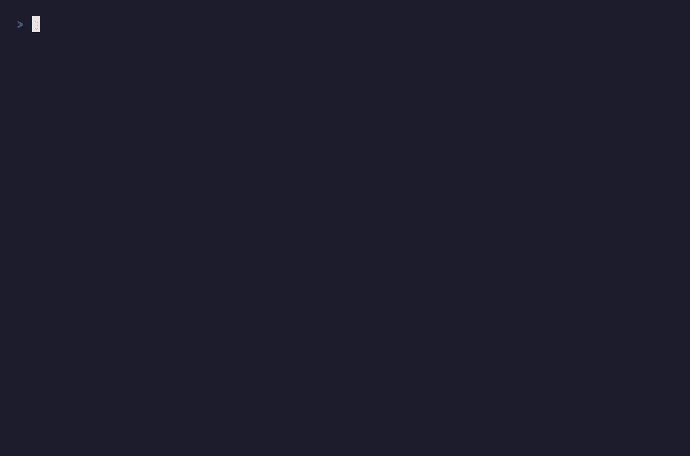

[English](README.md) · [简体中文](README.zh-CN.md) · [繁體中文](README.zh-TW.md) · [日本語](README.ja.md) · **한국어** · [Español](README.es.md) · [Português](README.pt-BR.md) · [Русский](README.ru.md)

<div align="center">

# add-reasoning-to-prs

**스스로 문서화하는 PR.** 변경의 *이유* —— 결정, 트레이드오프, 가정, 알려진 한계 —— 를 모든 풀 리퀘스트에 자동으로 써 넣는 [Claude Code](https://docs.claude.com/en/docs/claude-code) 훅입니다. 당신 자신의 에이전트가, 당신 자신의 머신에서 작성합니다.

[](https://www.npmjs.com/package/add-reasoning-to-prs)
[](https://github.com/backthread/add-reasoning-to-prs/actions/workflows/ci.yml)
[](LICENSE)
[](https://docs.claude.com/en/docs/claude-code)



</div>

> 번역은 커뮤니티의 최선의 노력이며 최신 내용에 뒤처질 수 있습니다. 정본은 영어판([README.md](README.md))입니다.

AI가 코드를 작성하지만, *이유* 는 아무도 기록하지 않습니다. 3주가 지나면 당신의 Git 이력은
명목상으로는 당신의 것이지만 실제로는 스스로 내린 적 없는 결정들의 더미가 됩니다 —— diff는
*무엇이* 바뀌었는지 말해 주고, `git blame` 은 *누가* 바꿨는지 말해 주지만, 그 이유는 그저…
사라져 있습니다.

이것은 그 문제를 근원에서 고치는 훅입니다. 에이전트가 PR을 열기(또는 기본 브랜치에 커밋을
쌓기) 직전에, 짧은 **「이유」 블록** —— 내린 결정, 저울질한 트레이드오프, 무엇을 가정했는지,
그리고 무엇을 알면서도 남겨 두었는지 —— 을 설명란에 곧바로 써 넣습니다. 실제 세션에서 가져온
것이며, diff에서 가져온 것이 아닙니다.

## 설치

명령어 하나:

```sh
npx add-reasoning-to-prs
```

이는 자체 완결적이고 의존성이 없는 훅을 안정적인 위치에 복사하고, 당신의 Claude Code 설정
(`~/.claude/settings.json`)에 `PreToolUse` 훅으로 등록합니다. 빌드 단계도, 계정도, 설정도
필요 없습니다.

또는 마켓플레이스에서 **Claude Code 플러그인** 을 설치하세요(권장 —— 플러그인 매니페스트에서
훅을 등록하고, 프로젝트 설정을 건드리지 않고 플러그인과 함께 업데이트됩니다).

> **요구 사항:** Claude Code 와 Node.js ≥ 22.18. 현재는 Claude Code 만 지원합니다 —— Cursor
> 와 Codex 가 다음 차례입니다.

## 무엇을 하나

| | |
|---|---|
| **PR 생성 시 「이유」 블록 자동 생성** | 에이전트가 「이유」 블록 없이 `gh pr create` 를 실행하면(또는 기본 브랜치에 커밋하면), 훅은 먼저 블록을 작성하도록 요청한 뒤 명령을 다시 실행하게 합니다. 한 번 설치하면 수동 단계는 전혀 없습니다. |
| **앞으로만 —— 결코 diff를 되풀이하지 않음** | diff가 *보여줄 수 없는* 것, 즉 추론과 알면서도 감수한 위험을 포착합니다. 리뷰어가 코드에서는 얻을 수 없는 그 한 가지를 맨 앞에 두며, 「X를 리팩터링, Y를 개선」 같은 군더더기로 채우지 않습니다. |
| **로컬, 당신 자신의 구독, 계정 불필요** | 블록은 세션 안에서 당신 자신의 에이전트가 작성합니다. 서버 왕복도 없고, 아무것도 저장되지 않으며, 당신의 소스는 머신을 떠나지 않습니다. |
| **결코 지어내지 않음** | 모든 줄은 세션 속의 실제 결정으로 거슬러 올라갈 수 있어야 합니다. 에이전트가 실제로 숙고하지 않았다면 블록은 추가되지 않습니다 —— 일상적인 변경에는 빈 블록이 올바른 답입니다. |

## 이것이 **하지 않는** 것

- **리뷰 봇이 아닙니다.** 코드를 채점하거나, PR에 점수를 매기거나, 병합을 막지 않습니다. diff *위에서*, 리뷰와 나란히 자리합니다 —— 맥락을 더할 뿐, 판정하지 않습니다.
- **다이어그램도, 위키도, 지식 그래프도 아닙니다.** 둘러볼 것도, 동기화를 유지할 것도 없습니다. 그저 이유를, 리뷰어가 이미 보는 곳 —— PR 설명란 —— 에 씁니다.
- **당신의 소스를 읽거나 어딘가로 보내지 않습니다.** 계정도, 업로드도, 텔레메트리도 없습니다. 블록은 당신이 이미 실행 중인 에이전트가, 당신 자신의 모델 구독으로, 당신의 머신에서 작성합니다.
- **앞으로만 향합니다.** 앞으로의 PR에 이유를 씁니다. 이미 닫힌 이력을 다시 쓰지 않으며, 무언가 잘못되어도 당신의 git 명령을 건드리지 않습니다 —— 훅 오류는 언제나 fail-open 합니다.

**무료, MIT, 영원히.** [Backthread](https://backthread.dev)(유료 호스팅 레이어)는 로컬 훅이
구조적으로 할 수 없는 부분 —— 팀 간, 이력, 그리고 능동적 푸시 —— 를 담당합니다. 이유가
당신에게 밀려오고, 코드베이스 전체에 걸쳐, 모두의 에이전트에 걸쳐 검색할 수 있게 됩니다.
이 훅은 그중 어느 것도 없이 그 자체로 유용합니다. 언젠가 팀 뷰를 원한다면
[backthread.dev](https://backthread.dev) 에 있습니다.

## 작동 방식

훅은 두 순간을 지켜봅니다: PR을 여는 순간(`gh pr create`)과, 기본 브랜치에 직접 커밋하는
순간입니다. 그중 하나가 「이유」 블록 없이 일어나는 것을 보면, 에이전트에게 그 세션 자체의
추론으로부터 근거 있고 앞으로만 향하는 블록 —— 변경 뒤의 **결정, 트레이드오프, 가정, 한계**
—— 을 작성하고 명령을 다시 실행하도록 요청합니다. 블록은 보이지 않는 마커로 감싸지므로,
한 번만 작성되고 결코 중복되지 않습니다.

- **피처 브랜치 커밋은 PR에 양보합니다.** 여러 세션에 걸친 작업은 로컬에서 앞으로 이어지므로,
  다른 세션이 PR을 열더라도 그 블록은 브랜치 전체를 아우릅니다.
- **결코 무언가를 지어내지 않습니다.** 에이전트는 먼저 빠른 자체 점검을 하고, 실제 결정으로
  거슬러 올라갈 수 없는 줄은 모두 버립니다. 세션이 숙고하지 않았다면 블록은 추가되지 않습니다.
- **결코 당신의 git 명령을 막지 않습니다.** 모든 실패 모드는 조용한 무작동입니다 —— 최악의
  경우라도 블록이 추가되지 않을 뿐입니다.

각 블록에는 작은 가시적 출처 표시가 있어 리뷰어가 그것이 어디에서 왔는지 볼 수 있으며 ——
당신은 자유롭게 편집하거나 삭제할 수 있습니다.

## 제어

- **저장소별로 끄기:** `git config add-reasoning-to-prs.disabled true`
- **단일 커밋/PR 건너뛰기:** 명령 어디든 `[skip-why]` 를 넣으세요.
- **전역으로 끄기:** Claude Code를 실행하는 환경에서 `ADD_REASONING_TO_PRS_DISABLE=1` 을
  설정하세요.

## 로드맵

이 프로젝트의 정직한 현황 —— 무엇이 작동하고, 다음은 무엇이며, 아직 무엇을 하지 않는지.

- **오늘 작동하는 것:** `gh pr create` 시의 「이유」 블록, 직접 푸시 시 커밋 메시지로의 폴백,
  브랜치를 가로지르는 다중 세션 이어가기, 100% 로컬(당신 자신의 모델, 계정 불필요), 지어내지
  않음, 그리고 fail-open.
- **다음:** Cursor 와 Codex 지원(현재는 Claude Code 만 —— 목록 최상단입니다) · 브라우저에서
  열린 PR 커버리지 · 더 촘촘한 「이유」 블록 형식.
- **알려진 공백:** 다중 세션 수집은 최선의 노력(로컬의 브랜치별 스크래치패드)이며, squash
  병합 후 블록이 어떻게 읽히는지는 아직 다듬는 중입니다.

전체 목록은 [Issues](../../issues) 와 [Discussions](../../discussions) 에 있습니다 ——
당신에게 중요한 한계에 👍 를 눌러 주면 목록에서 위로 올라갑니다.

## 기여하기

기여를 환영합니다 —— 특히 버그 수정, 더 날카로운 프롬프트/안내 문구, 엣지 케이스 커버리지,
그리고 더 많은 에이전트 지원입니다. 이것은 작고 단일 목적의 도구이며 앞으로도 그렇게 유지할
생각이므로, 범위를 넓히려는 요청은 대개(정중하게, 이유를 곁들여) 사양합니다.
[기여 가이드](CONTRIBUTING.md)와 [`good first issue`](../../labels/good%20first%20issue) 라벨
부터 시작하세요. 어떤 아이디어가 맞을지 확신이 서지 않는다면, 먼저
[Discussion](../../discussions) 을 열어 주세요.

## 별을 눌러 주세요

이것이 당신 자신의 옛 PR들을 고고학 발굴하듯 되짚는 수고를 단 한 번이라도 덜어 준다면,
⭐ 하나가 다른 사람들이 이것을 발견하는 데 도움이 됩니다.

## 라이선스

MIT © [Backthread](https://backthread.dev). 마음껏 사용하세요.
